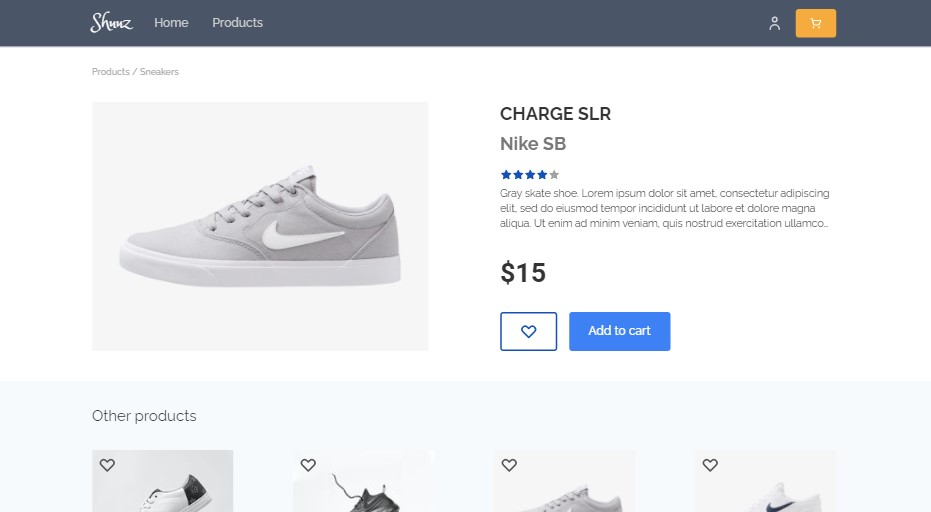

# Shuuz

shoe e-commerce website

## Features

- Own design
- Vue3 + Vuex store
- Strapi as a back-end
- JWT Auth
- Products can be added, edited and deleted by admin user.
- Hero banner can be customized in admin dashboard.
- Customer can store favourite items.
- Cart shows all added items and sums up the total price

## Credits

- [ TailwindCSS](https://tailwindcss.com/)
- [ TypeScript](https://www.typescriptlang.org/)
- [ Vue 3](https://v3.vuejs.org/)
- [ Vuex 4](https://vuex.vuejs.org/)
- [ Strapi](https://strapi.io/)
- [Eva-Icons](https://akveo.github.io/eva-icons/#/)
